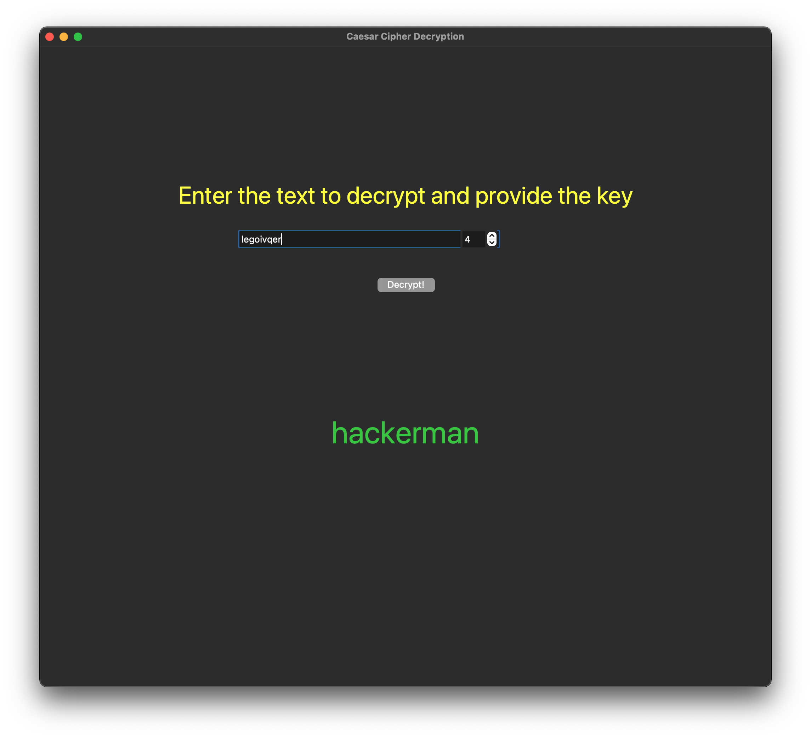

# Decrypting-Using-Caesar-Cipher
A simple GUI to decrypt a given cipher text with the provided key


### More Info
This program provides a GUI to decrypt a given cipher text that has been encrypted using the Caesar Cipher Encryption

The user needs to provide the text and the key for decryption.

The decrypted text is automatically copied on the clipboard.

### How to run

Make sure you have Tkinter installed or install using:

```sh
pip install tk
```

Run the app using:
```sh
python3 main.py
```

### Example Usage

Enter the cipher text


Get the plain text and the key


